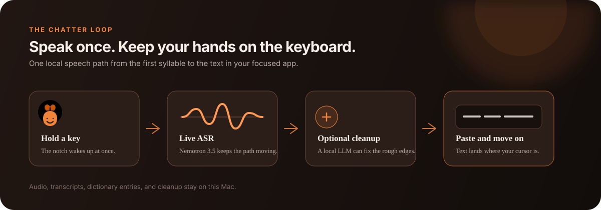

# Chatter

Speak to your Mac without leaving the keyboard.

[](https://github.com/ajaitly11/Chatter/releases/latest)
[](https://github.com/ajaitly11/Chatter/actions/workflows/release.yml)
[](https://ajaitly11.github.io/Chatter/)



Chatter is a local macOS dictation app for people who think faster than they
type. Hold a key, talk, and release. Your words appear in the app that already
has focus. A small notch HUD shows what is happening, so you do not have to
switch away from the thing you are writing.

The important part is the speech path: one streaming ASR model handles live
dictation from the first syllable to the final raw transcript. Optional local
AI cleanup sits beside that path. It can improve punctuation and formatting,
but it never replaces the speech model or has to be enabled for Chatter to
work.

## What Chatter can do

- Live push-to-talk dictation with a notch HUD and live preview.
- Hands-free dictation by double-tapping the selected hotkey to start and stop.
- Audio and video file transcription with plain text, SRT, and VTT export.
- Word-level subtitle timing when the selected file model provides word
  timestamps; phrase-level timing remains available for models such as Whisper.
- Optional local cleanup for punctuation, filler words, self-corrections, and
  simple lists.
- A personal dictionary, local history, and private usage insights.
- Input-device selection, automatic foreground-app writing context, and a
  menu-bar companion.

## Download and try it

Chatter currently ships as an Apple Silicon macOS app.

1. Download the [latest DMG](https://github.com/ajaitly11/Chatter/releases/latest).
2. Drag `Chatter.app` to `Applications` and open it.
3. Give **Chatter** permission in macOS when asked. The app needs:
   - **Microphone** to hear your voice.
   - **Input Monitoring** to notice the global hotkey.
   - **Accessibility** to paste the finished text into the focused app.

These permissions belong to Chatter. You do not need to change the settings
for unrelated apps. Audio, transcripts, models, dictionary entries, and
cleanup prompts stay on this Mac.

Once setup is complete, choose a microphone in **Settings**, pick a hotkey,
and hold it anywhere on your Mac. The default is **Right Shift**. If you turn
on hands-free mode, double-tap the same key to start listening and double-tap
it again to stop.

## Choose models without guessing

You only need one model to start live dictation. Use the
[model guide](docs/model-guide.md) if you are not sure what your Mac can
handle.

| Job | Starting point | What it does |
| --- | --- | --- |
| Live dictation | Nemotron 3.5 streaming, Q8_0 | Produces the live preview and raw transcript. |
| Optional cleanup | A small 2B-4B instruct GGUF | Adds punctuation and repairs formatting after or alongside dictation. |
| File transcription | Parakeet TDT or Whisper large-v3 Turbo | Transcribes longer audio and video files. Parakeet is the better starting point for word-level timing. |

Start with cleanup off. If the raw transcript feels fast and reliable, enable
**Clean up with local AI** in Settings. Cleanup is deliberately optional so a
larger language model cannot hold up the live speech path.

## Run from source

### Requirements

- Apple Silicon Mac running a recent macOS release.
- Python 3.11 or newer.
- `ffmpeg` for audio and video file transcription.
- Local model files imported through Chatter's Models view.

Install `ffmpeg` with Homebrew:

```bash
brew install ffmpeg
```

Create a virtual environment and install the Python dependencies:

```bash
python3 -m venv venv
source venv/bin/activate
python -m pip install -r requirements.txt
```

Run the development app:

```bash
python main.py
```

To build the macOS application bundle:

```bash
./packaging/build_app.sh
open Chatter.app
```

The build keeps large GGUF files outside the bundle. If a local `models`
folder exists, the bundle links to it; otherwise Chatter guides you to import
models after launch. To put the result in Launchpad and Applications:

```bash
ditto Chatter.app /Applications/Chatter.app
open -a /Applications/Chatter.app
```

## Optional local cleanup

Cleanup uses a small chat-capable GGUF model through `llama-server` from
[llama.cpp](https://github.com/ggml-org/llama.cpp). Set these two paths in
`~/Library/Application Support/Chatter/config.json` after the first run:

```json
{
  "llama_server_bin": "/absolute/path/to/llama-server",
  "llama_model_path": "/absolute/path/to/cleanup-model.gguf"
}
```

If the server is not configured or cannot start, Chatter keeps the raw
transcript. Cleanup is never required for live or file transcription.

The experimental Gemma multi-token prediction setting can use a matching
`MTP/` head beside a compatible cleanup model. It affects only the optional
language-model pass; it is not part of Nemotron's ASR path.

## A few details worth knowing

- Chatter saves history, dictionary entries, and insights locally. There is no
  account or cloud analytics layer.
- The automatic writing context uses the foreground app name and window title
  as a hint. It does not read the page, document, or editor contents.
- Word-level subtitle export uses timings returned by the selected model. If a
  model only returns phrase timestamps, Chatter does not invent word timings.
- Local development builds can need a fresh permission grant because macOS
  ties privacy permissions to an app's signed identity. Release builds use the
  stable Chatter release identity.
- A locally built bundle contains the checkout paths used at build time. If you
  move the repository, rebuild the app.

## Test the project

Run the test suite from the repository root:

```bash
python -m unittest discover -s tests -q
```

The tests cover hotkey options, audio and transcription behavior, the live
editor, dictionary learning, formatting, insights, and update checks.

## Project map

```text
chatter/                 App, audio pipeline, HUD, settings, and UI
tests/                   Unit tests for the local pipeline and user flows
docs/model-guide.md      Short model-selection guide
docs/index.html          Static landing page
packaging/build_app.sh   macOS app build
packaging/make_icon.py   Character icon generation
```

Chatter is still being shaped. The goal is a useful local tool first: fast
enough to stay in the flow, clear enough to trust, and playful enough to make
dictation feel less like a utility.
